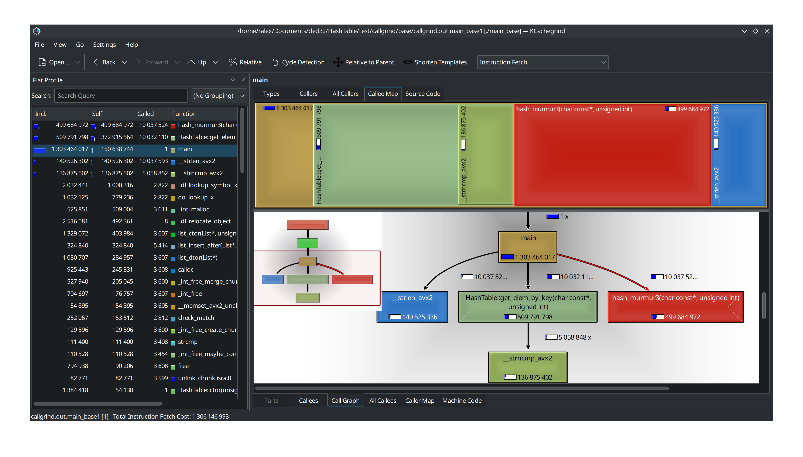
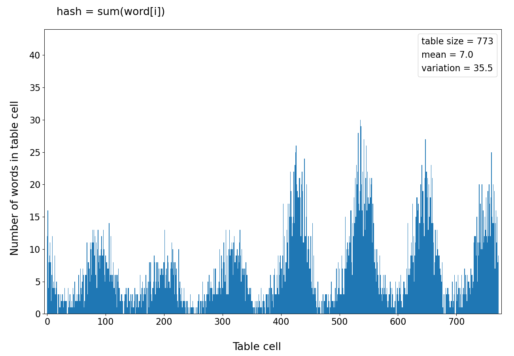
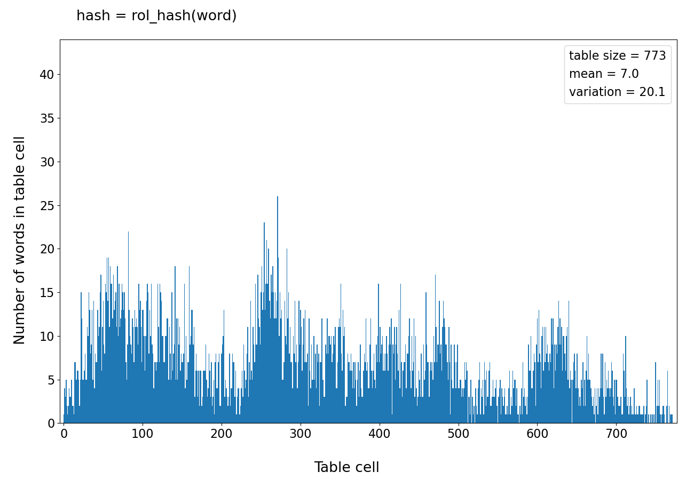
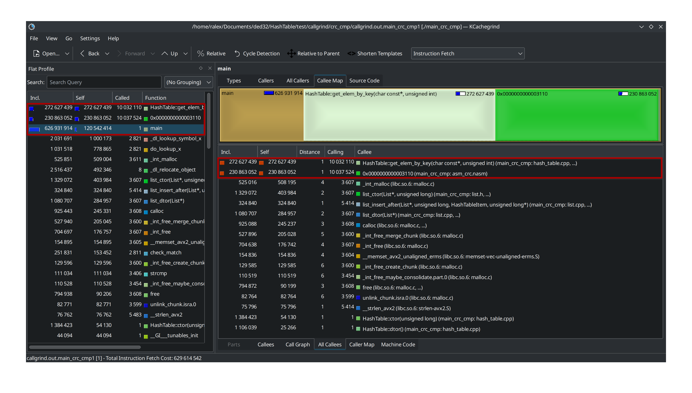

# Содержание

1. [Оптимизация хеш таблицы](#оптимизация-хеш-таблицы)
    1. [Сравнение хеш-функций](#сравнение-хеш-функций)
        1. [Замечание о циклических сдвигах](#замечание-о-циклических-сдвигах)
    2. [Оптимизации](#оптимизации)
    3. [Варианты программы:](#варианты-программы)
        1. [1. `debug` - дебаг версия без оптимизаций](#1-debug---дебаг-версия-без-оптимизаций)
        2. [2. `base` - базовая версия без оптимизаций](#2-base---базовая-версия-без-оптимизаций)
        3. [3. `crc` - оптимизация подсчёта хеша](#3-crc---оптимизация-подсчёта-хеша)
        4. [4. `crc + cmp` - предыдущее + оптимизация сравнения строк](#4-crc--cmp---предыдущее--оптимизация-сравнения-строк)
    4. [Итоговые измерения](#итоговые-измерения)
    5. [Вывод](#вывод)
2. [Источники и инструменты](#источники-и-инструменты)
3. [Благодарности](#благодарности)

# Оптимизация хеш таблицы

| Параметры | |
|:--|:--|
| Ключ: | английское слово |
| Значение: | количество таких слов в тексте |

Таблица представляет собой массив двусвязных списков. При добавлении рассчитывается хеш слова, индекс списка из массива - остаток от деления хеша на размер таблицы. Если слова ещё нет в выбранном списке, то оно будет добавлено.

Размер таблицы как правило выбирают простым числом для того, чтобы не было цикличности при взятии остатка от деления. Размер рассчитывается исходя из load factor - ожидаемого количества слов в одном списке. Оптимальное значение `1-3`, однако для исследования возьмём его равным `7`.

## Сравнение хеш-функций

Размер хеша - `32` бита.

На вход подаётся набор из `32 110` английских слов (`5 414` уникальных).

Для всех вариантов кроме одного размер таблицы `773` (load factor `7`).

Для сравнения были выбраны 9 хеш-функций:

1. Всегда 0
2. Длина слова
3. ASCII код первого символа
4. Сумма ASCII кодов символов разделить на длинну слова
5. Сумма ASCII кодов символов. Размер таблицы 100
6. Сумма ASCII кодов символов
7. Для пустого слова 0. Далее в цикле по всему слову: `hash = ror(hash, 1) xor word[i]`, где `ror` - циклический битовый сдвиг вправо на один бит
8. То же, что и предыдущее, но `rol` - циклический битовый сдвиг влево на один бит
9. `CRC32`

Ниже представлены гистограммы для всех вариантов хеш-функций.

- По горизонтали номер двусвязного списка в таблицы
- По вертикали заполненность соответсвующего списка

Обратите внимание: на первых 4 гистограммах ось X обрезана на 200.

 

 


 

 

Ниже представлены параметры распределений. В данном случае математическое ожидание совпадает с load factor. Результат тем лучше, чем меньше дисперсия, так как она определяет среднюю длину списка, а значит и время линейного поиска.

| # | Хэш | Размер табл. | Мат. ожидание | Дисперсия |
|:-:|:--|:-:|:-:|:-:|
| 1 | `0` | 773 | 7.0 | 37870.0 |
| 2 | `len(word)` | 773 | 7.0 | 5103.2 |
| 3 | `word[0]` | 773 | 7.0 | 1534.0 |
| 4 | `sum(word[i]) / len(word)` | 773 | 7.0 | 2599.1 |
| 5 | `sum(word[i])` | 100 | 54.1 | 370.6 |
| 6 | `sum(word[i])` | 773 | 7.0 | 35.5 |
| 7 | `ror() xor word[i]` | 773 | 7.0 | 38.2 |
| 8 | `rol() xor word[i]` | 773 | 7.0 | 20.1 |
| 9 | `CRC32` | 773 | 7.0 | 6.8 |

- Как видим наилучший результат ожидаемо показала функция `CRC32`.
- Плохой результат хешей 1-4 объясняется тем, что разброс их значений слишком мал.
- Сумма кодов символов для таблицы размером `773` слишком периодична. Это объясняется тем, что ASCII коды маленьких английских букв лежат в диапазоне от `97` до `122`. Но этот диапазон сравним с размером таблицы `100`, поэтому периодичность уже не заметна.
- На гистограмме для циклического сдвига вправо виден ярко выраженный пик. Сдвиг влево показал себя лучше.

### Замечание о циклических сдвигах

В языках `C` и `С++` нет команд циклического сдвига, несмотря на то, что существуют соответсвующие машинные команды (`rol` и `ror` в `x86`). Реализация может представлять собой два обычных битовых сдвига:


Современные компиляторы с включенными оптимизациями понимают, что имеется ввиду, и заменяют эти несколько команд на одну:


## Оптимизации

Целевое использование программы - поиск слов. Эту часть и будем оптимизировать.

Начальные параметры:

- хеш: `CRC32`
- входные данные: `32 110` английских слов (`5 414` уникальных)
- load factor: `7` (размер таблицы `773`)
- данные для поиска: `10 000 000` случайных английских слов (половина из входных данных, половина из словаря)

Для начала "оптимизируем" входные данные. Приведём их к виду, максимально быстрому для чтения, а также обеспечим выравнивание начал слов по 32 байтам (это нужно для `AVX` инструкций).

Каждое слово занимает 32 байта. Сначала идут буквы, после них `\0`:


Параметры тестовой машины:
- Компилятор: `g++ (GCC) 13.2.1 20230801`
- Процессор: `Intel(R) Core(TM) i7-6700HQ CPU @ 2.60GHz SkyLake`
- ОС: `Arch Linux`, Kernel: `6.6.22-1-lts (64-bit)`
- Профилировщик: `valgrind-3.22.0`

При помощи инструмента `callgrind` утилиты `valgrind` и программы `KCachegrind` определили узкие места программы:


По полученным данным реализовали оптимизации функций подсчёта хеша и линейного поиска по спискам.

## Варианты программы:

### 1. `debug` - дебаг версия без оптимизаций

- `g++ -O0`

Включены верификаторы списков и `assert`.

### 2. `base` - базовая версия без оптимизаций

- `g++ -O2`

### 3. `crc` - оптимизация подсчёта хеша

- `g++ -O2`

Оптимизируем подсчёт хеша `CRC32` (было):

```
uint32_t strcrc(const char* data) {
    assert(data);

    uint32_t crc = 0;
    size_t size = 0;

    while (*data) {
        size++;

        unsigned char c = *(data++);
        crc = (crc << 8) ^ crctab[(crc >> 24) ^ c];
    }

    while (size != 0) {
        unsigned char c = size & 0377;
        size >>= 8;
        crc = (crc << 8) ^ crctab[(crc >> 24) ^ c];
    }

    return ~crc;
}
```

Подсчёт при помощи ассемблерной инструкции `crc32` (стало):

```
uint32_t strcrc_asm(const char* data) {
    assert(data);

    uint32_t hash = 0;

    while (*data)
        asm ("crc32 %0, %1\n" : "=r"(hash) : "r"(*data++), "r"(hash));

    return hash;
}
```

### 4. `crc + cmp` - предыдущее + оптимизация сравнения строк

Целью работы является максимальная оптимизация программы. В промышленной задаче можно было бы остановиться на пердыдущем шаге, так как дальнейшие улучшения опираются на частный случай и достаточно сильно ухудшают совместимость и читаемость кода.

- `g++ -O2`
- компилятор сравнивал строки при помощи векторных инструкций из набора `AVX2`. Для наших входных данных известно, что в словах точно меньше 32 букв. Также у нас есть возможность сделать предпосчёт длинны слов, находящихся в словаре. Таким образом для сравнения двух слов требуется:
    1. `_mm256_load_si256(__m256i a)` - загрузить слова в расширенный регистр (выравнивание обеспечено входными данными).
    2. `_mm256_cmpeq_epi8(__m256i a, __m256i b)` - сравнить буквы.
    3. `_mm256_movemask_epi8(__m256i a)` - создать маску из результата сравнения.
    4. `(~mask << (31 - elem.key_len))` - инвертировать биты маски и битовым сдвигом отбросить лишние биты.
    5. Если полученный результат равен 0, то слова совпали.
- Такая реализация быстрее стандартной, так как выполнена для частного случая. Стандартная библиотека языка `C` всё-таки обязана быть универсальной.

```
Elem_t* HashTable::get_elem_by_key(Key_t key, Hash_t hash) {

    List* list = table_ + (hash % table_size_);

    const __m256i key_vector = _mm256_load_si256((const __m256i*)key);

    for (size_t list_node = list_head(list); list_node > 0; list_node = list->arr[list_node].next) {
        Elem_t elem = list->arr[list_node].elem;

        if (elem.hash != hash)
            continue;

        const __m256i elem_key_vector = _mm256_load_si256((const __m256i*)elem.key);

        __m256i cmp = _mm256_cmpeq_epi8(key_vector, elem_key_vector);

        unsigned int mask = (unsigned int)_mm256_movemask_epi8(cmp);

        if ((~mask << (31 - elem.key_len)) == 0)
            return &list->arr[list_node].elem;
    }

    return nullptr;
}
```

## Итоговые измерения
<table>
    <thead>
        <tr>
            <th rowspan=2>Оптимизация</th>
            <th colspan=3 style="text-align: center">Вся программа</th>
            <th colspan=3 style="text-align: center">Функция поиска</th>
        </tr>
        <tr>
            <th style="text-align: center">Ir * 10^6</th>
            <th style="text-align: center">% от base</th>
            <th style="text-align: center">% от предыдущего</th>
            <th style="text-align: center">Ir * 10^6</th>
            <th style="text-align: center">% от base</th>
            <th style="text-align: center">% от предыдущего</th>
        </tr>
    </thead>
    <tbody>
        <tr>
            <td>debug</td>
            <td style="text-align: center">4 179</td>
            <td style="text-align: center">228%</td>
            <td style="text-align: center"></td>
            <td style="text-align: center">4 004</td>
            <td style="text-align: center">233%</td>
            <td style="text-align: center"></td>
        </tr>
        <tr>
            <td>base</td>
            <td style="text-align: center">1 833</td>
            <td style="text-align: center">100%</td>
            <td style="text-align: center">44%</td>
            <td style="text-align: center">1 721</td>
            <td style="text-align: center">100%</td>
            <td style="text-align: center">43%</td>
        </tr>
        <tr>
            <td>crc</td>
            <td style="text-align: center">1 265</td>
            <td style="text-align: center">69%</td>
            <td style="text-align: center">69%</td>
            <td style="text-align: center">1 153</td>
            <td style="text-align: center">67%</td>
            <td style="text-align: center">67%</td>
        </tr>
        <tr>
            <td>crc + cmp</td>
            <td style="text-align: center">1 076</td>
            <td style="text-align: center">59%</td>
            <td style="text-align: center">85%</td>
            <td style="text-align: center">964</td>
            <td style="text-align: center">56%</td>
            <td style="text-align: center">84%</td>
        </tr>
    </tbody>
</table>

Обе оптимизации оказались оправданными, так как существенно ускорили программу. При этом не пришлось писать большой объём ассемблерного кода.

Результаты профилирования со всеми оптимизациями:



## Вывод

Видим, что практически всё время программы теперь занимают линейный поиск по спискам и подсчёт хешей. Обе операции мы уже оптимизировали. Остальные функции выполняются на несколько порядков быстрее и оптимизировать их не имеет смысла.

# Источники и инструменты

1. **Computer Systems: A Programmer's Perspective** 3rd Edition by **Randal Bryant**, **David O'Hallaron**
2. **Compiler explorer** - [godbolt.com](https://godbolt.com)
3. **Valgrind** - [valgrind.org](https://valgrind.org/docs/manual/index.html)
4. **Mirror of Intel Intrinsics Guide** - [laurence.com/sse](https://www.laruence.com/sse/)
5. **Jupyter Notebook** - [jupyter.org](https://jupyter.org/)
6. **Python Matplotlib** - [matplotlib.org](https://matplotlib.org/)

# Благодарности
- [Ilya Dedinsky](https://github.com/ded32) aka Ded as prepod
- [Aleksei Durnov](https://github.com/Panterrich) as mentor
