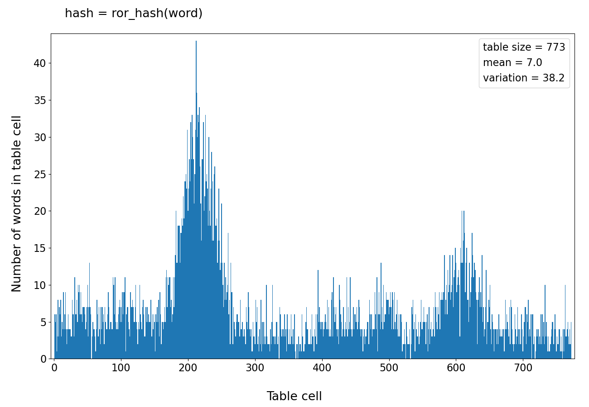
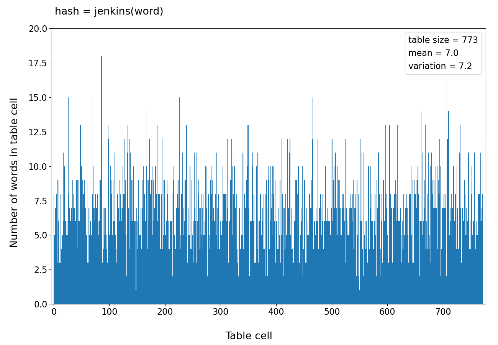
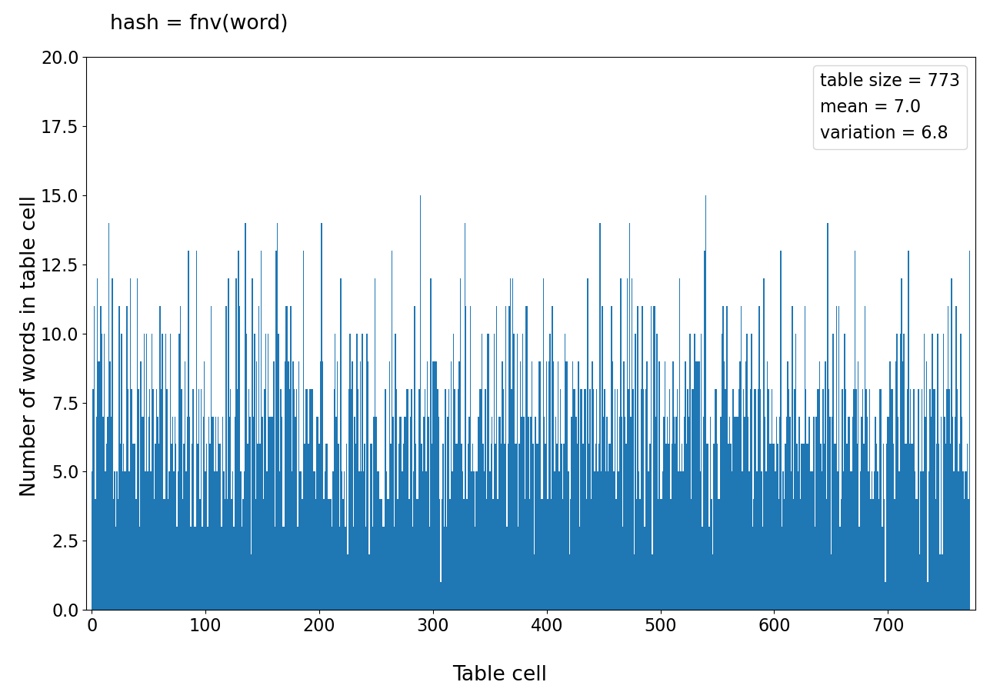
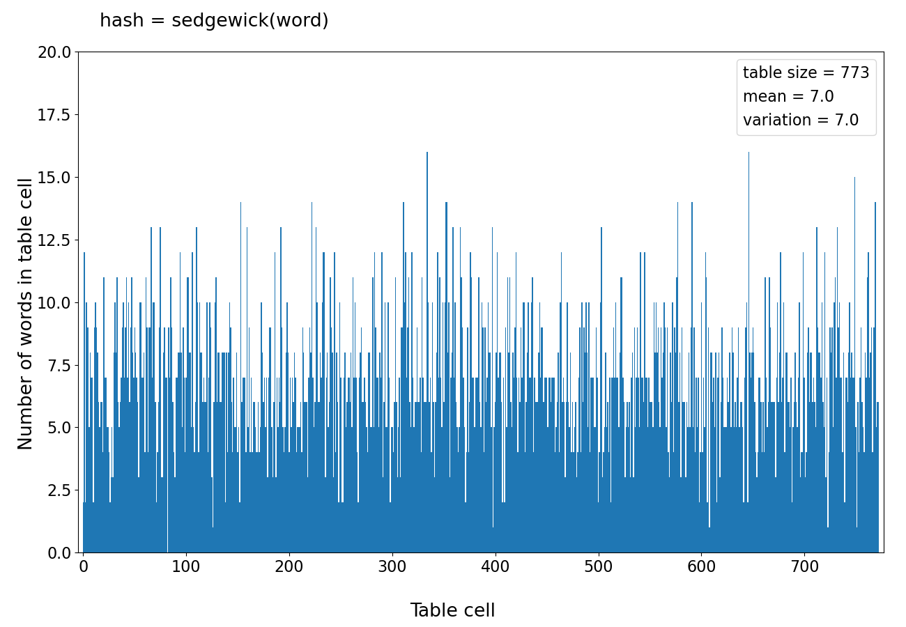
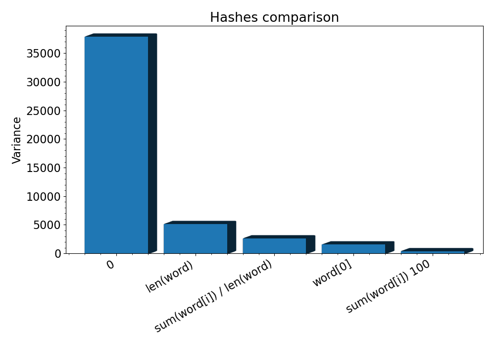
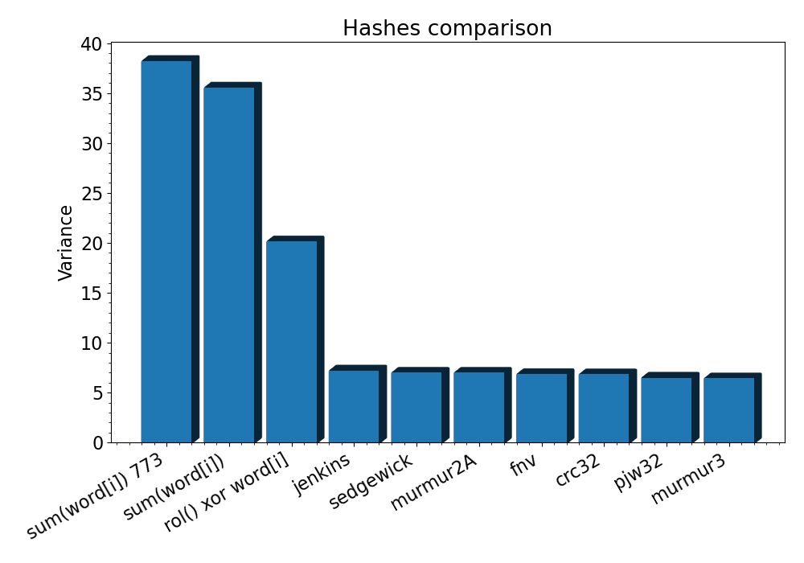
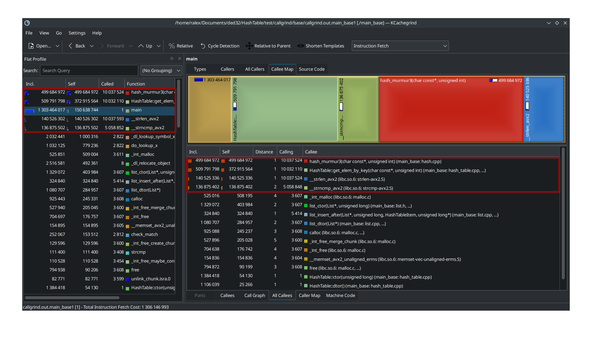
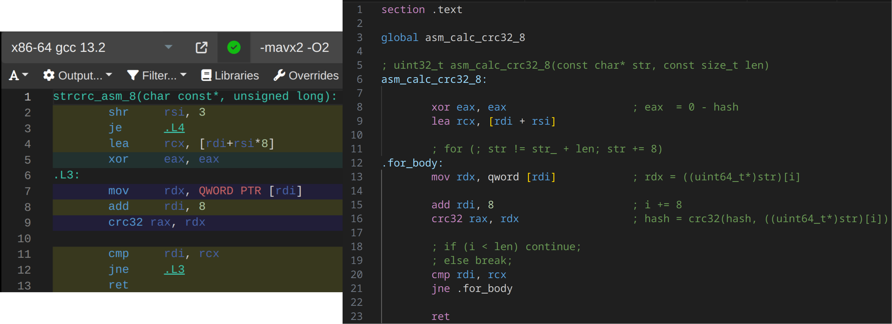

# Содержание

1. [Хеш таблица](#хеш-таблица)
2. [Оптимизация хеш таблицы](#оптимизация-хеш-таблицы)
    1. [Сравнение хеш-функций](#сравнение-хеш-функций)
        1. [Замечание о циклических сдвигах](#замечание-о-циклических-сдвигах)
    2. [Оптимизации](#оптимизации)
    3. [Варианты программы:](#варианты-программы)
        1. [1. `debug` - дебаг версия без оптимизаций](#1-debug---дебаг-версия-без-оптимизаций)
        2. [2. `base` - базовая версия без оптимизаций](#2-base---базовая-версия-без-оптимизаций)
        3. [3. `crc` - замена хеша на `CRC32` и ассемблерная оптимизация](#3-crc---замена-хеша-на-crc32-и-ассемблерная-оптимизация)
        4. [4. `crc + cmp` - предыдущее + оптимизация сравнения строк](#4-crc--cmp---предыдущее--оптимизация-сравнения-строк)
    4. [Итоговые измерения](#итоговые-измерения)
    5. [Сравнение результатов `callgrind` и `perf`](#сравнение-результатов-callgrind-и-perf)
    6. [Вывод](#вывод)
3. [Источники и инструменты](#источники-и-инструменты)
4. [Благодарности](#благодарности)

# Хеш таблица

Хеш таблица - структура данных, которую используют для быстрых операций вставки/удаления/поиска. Каждый элемент представляет собой пару ключ-значение.

Каждому ключу ставится в соответствие значение хеш-функции. Совпадение этих значений для разных ключей называется коллизией. Есть несколько подходов к решению этой проблемы. Мы будем использовать метод списков.

Таблица представляет собой массив двусвязных списков. Пара ключ-значение находится в списке, индекс которого равен остатку от деления значения хеша ключа на размер таблицы.


Красные стрелки - коллизия. Хеши ключей `Hello` и `World` имеют одинаковый остаток от деления на размер таблицы. Из-за этого оба элемента попали в один список.

Размер таблицы как правило выбирают простым числом для того, чтобы не было цикличности при взятии остатка от деления. Размер рассчитывается исходя из load factor - ожидаемого количества значений в одном списке (размер таблицы разделить на количество уникальных ключей). Оптимальное значение `0.5-1.5`.

# Оптимизация хеш таблицы

| Параметры | |
|:--|:--|
| Ключ: | английское слово |
| Значение: | количество таких слов в тексте |
| Задача оптимизации: | поиск слова |

## Сравнение хеш-функций

Размер хеша - `32` бита.

На вход подаётся набор из `32 110` английских слов (`5 414` уникальных).

Для всех вариантов кроме одного выбран размер таблицы `773` (load factor `7`). Такой load factor выбран специально для сравнения функций, так как при меньшей величине будет хуже видна неравномерность распределения.

Для сравнения были выбраны 15 хеш-функций:

1. Всегда 0
2. Длина слова
3. ASCII код первого символа
4. Сумма ASCII кодов символов разделить на длину слова
5. Сумма ASCII кодов символов. Размер таблицы 100
6. Сумма ASCII кодов символов
7. Для пустого слова 0. Далее в цикле по всему слову: `hash = ror(hash, 1) xor word[i]`, где `ror` - циклический битовый сдвиг вправо на один бит
8. То же, что и предыдущее, но `rol` - циклический битовый сдвиг влево на один бит
9. [`CRC32`](https://ru.wikipedia.org/wiki/Crc) - циклический избыточный код
10. [`PJW-32`](https://ru.wikipedia.org/wiki/PJW-32) - хеш-функция, разработанная Питером Вэйнбергером (Peter J. Weinberger) из AT&T Bell Laboratories.
11. [`Jenkins one-at-a-time`](https://en.wikipedia.org/wiki/Jenkins_hash_function) - 32 битная хеш-функция общего назначения, разработанная Бобом Дженкинсом.
12. [`FNV`](https://ru.wikipedia.org/wiki/FNV) - простая хеш-функция для общего применения, разработанная Гленом Фаулером, Лондоном Керт Нолом и Фогном Во.
13. [`Robert Sedgewick`](https://guildalfa.ru/alsha/node/32) - простейшая строковая 32-битная хеш-функция. Содержит всего два умножения и одно сложение. Имеет мало коллизий для английских слов
14. [`MurmurHash2A`](https://ru.wikipedia.org/wiki/MurmurHash2) - простая и быстрая хеш-функция общего назначения, разработанная Остином Эпплби.
15. [`MurmurHash3`](https://github.com/aappleby/smhasher/blob/master/src/MurmurHash3.cpp) - улучшенная версия `MurmurHash2`

Ниже представлены гистограммы для всех вариантов хеш-функций.

- По горизонтали номер двусвязного списка в таблицы
- По вертикали заполненность соответствующего списка

Обратите внимание: на первых 4 гистограммах ось X обрезана на 200.

 

 


 

 

 

 

 

Ниже представлены параметры распределений, отсортированные по убыванию дисперсии. В данном случае математическое ожидание совпадает с load factor. Результат тем лучше, чем меньше дисперсия, так как она определяет среднюю длину списка, а значит и время линейного поиска.

| # | Хэш | Размер табл. | Мат. ожидание | Дисперсия |
|:-:|:-:|:-:|:-:|:-:|
| 1 | `0` | 773 | 7.0 | 37870.0 |
| 2 | `len(word)` | 773 | 7.0 | 5103.2 |
| 3 | `sum(word[i]) / len(word)` | 773 | 7.0 | 2599.1 |
| 4 | `word[0]` | 773 | 7.0 | 1534.0 |
| 5 | `sum(word[i])` | 100 | 54.1 | 370.6 |
| 6 | `ror() xor word[i]` | 773 | 7.0 | 38.2 |
| 7 | `sum(word[i])` | 773 | 7.0 | 35.5 |
| 8 | `rol() xor word[i]` | 773 | 7.0 | 20.1 |
| 9 | `jenkins` | 773 | 7.0 | 7.2 |
| 10 | `sedgewick` | 773 | 7.0 | 7.0 |
| 11 | `murmur2A` | 773 | 7.0 | 7.0 |
| 12 | `fnv` | 773 | 7.0 | 6.8 |
| 13 | `crc32` | 773 | 7.0 | 6.8 |
| 14 | `pjw32` | 773 | 7.0 | 6.5 |
| 15 | `murmur3` | 773 | 7.0 | 6.4 |

 

- Плохой результат хешей 1-4 объясняется тем, что разброс их значений слишком мал.
- Сумма кодов символов для таблицы размером `773` слишком периодична. Это объясняется тем, что ASCII коды маленьких английских букв лежат в диапазоне от `97` до `122`. Но этот диапазон сравним с размером таблицы `100`, поэтому периодичность уже не заметна.
- На гистограмме для циклического сдвига вправо виден ярко выраженный пик. Сдвиг влево показал себя лучше.
- Наилучшие результаты показали `murmur3`, `pjw32`, `crc32` и `fnv`. В дальнейшем будем использовать `murmur3`, так как её реализация векторизована по 4 байта. Также проверим ассемблерную оптимизацию `crc32`.

### Замечание о циклических сдвигах

В языках `C` и `С++` нет команд циклического сдвига, несмотря на то, что существуют соответствующие машинные команды (`rol` и `ror` в `x86`). Реализация может представлять собой два обычных битовых сдвига:


Современные компиляторы с включенными оптимизациями понимают, что имеется ввиду, и заменяют эти несколько команд на одну:


## Оптимизации

Целевое использование программы - поиск слов. Эту часть и будем оптимизировать.

Начальные параметры:
- хеш: `murmur3`
- входные данные: `32 110` английских слов (`5 414` уникальных)
- load factor: `1.5` (размер таблицы `3 607`)
- данные для поиска: `10 000 000` случайных английских слов (половина из входных данных, половина из английского словаря)

Для начала "оптимизируем" входные данные. Приведём их к виду, максимально быстрому для чтения, а также обеспечим выравнивание начал слов по 32 байтам (это нужно для `AVX` инструкций).

Каждое слово занимает 32 байта. Сначала идут буквы, после них `\0`:


Параметры тестовой машины:
- Компилятор: `g++ (GCC) 13.2.1 20230801`
- Процессор: `Intel(R) Core(TM) i7-6700HQ CPU @ 2.60GHz SkyLake`
- ОС: `Arch Linux`, Kernel: `6.6.22-1-lts (64-bit)`
- Профилировщик: `valgrind-3.22.0`

При помощи инструмента `callgrind` утилиты `valgrind` и программы `KCachegrind` определили узкие места программы:



По полученным данным реализовали оптимизации функций подсчёта хеша и линейного поиска по спискам.

## Варианты программы:

### 1. `debug` - дебаг версия без оптимизаций

- `g++ -O0`

Включены верификаторы списков и `assert`.

### 2. `base` - базовая версия без оптимизаций

- `g++ -O2`

### 3. `crc` - замена хеша на `CRC32` и ассемблерная оптимизация

- `g++ -O2`

Подсчёт при помощи ассемблерной инструкции `crc32`:

```
inline uint32_t strcrc_asm_8(const char* data, const uint32_t len) {
    assert(data);
    assert(len % 8 == 0);

    uint64_t hash = 0;

    for (size_t i = 0; i < len / 8; i++)
        asm ("crc32 %0, %1\n" : "=r"(hash) : "r"(((const uint64_t*)data)[i]), "r"(hash));

    return (uint32_t)hash;
}
```

Ту же оптимизацию можно провести при помощи аналогичной функции, полностью написанной на ассемблере. Она представлена в файле [asm_crc.nasm](src/hash/asm_crc.nasm). Разницы во времени исполнения нет, так как компилятор генерирует почти такой же код. Однако первый вариант предпочтительнее, так как его легче сопровождать, а так же нет необходимости ассемблировать и линковать отдельный файл.



### 4. `crc + cmp` - предыдущее + оптимизация сравнения строк

Целью работы является максимальная оптимизация программы. В промышленной задаче можно было бы остановиться на предыдущем шаге, так как дальнейшие улучшения опираются на частный случай и достаточно сильно ухудшают совместимость и читаемость кода.

- `g++ -O2`
- компилятор сравнивал строки при помощи векторных инструкций из набора `AVX2`. Для наших входных данных известно, что в словах точно меньше 32 букв. Также у нас есть возможность сделать предподсчёт длинны слов, находящихся в словаре. Таким образом для сравнения двух слов требуется:
    1. `_mm256_load_si256(__m256i a)` - загрузить слова в расширенный регистр (выравнивание обеспечено входными данными).
    2. `_mm256_cmpeq_epi8(__m256i a, __m256i b)` - сравнить буквы.
    3. `_mm256_movemask_epi8(__m256i a)` - создать маску из результата сравнения.
    4. Если все биты в маске `1`, то слова совпали.
- Такая реализация быстрее стандартной, так как выполнена для частного случая. Стандартная библиотека языка `C` всё-таки обязана быть универсальной.

```
Elem_t* HashTable::get_elem_by_key(Key_t key, Hash_t hash) {

    List* list = table_ + (hash % table_size_);

    const __m256i key_vector = _mm256_load_si256((const __m256i*)key);

    for (size_t list_node = list_head(list); list_node > 0; list_node = list->arr[list_node].next) {
        Elem_t elem = list->arr[list_node].elem;

        if (elem.hash != hash)
            continue;

        const __m256i elem_key_vector = _mm256_load_si256((const __m256i*)elem.key);

        __m256i cmp = _mm256_cmpeq_epi8(key_vector, elem_key_vector);

        unsigned int mask = (unsigned int)_mm256_movemask_epi8(cmp);

        if (mask == (uint32_t)-1) [[likely]]
            return &list->arr[list_node].elem;
    }

    return nullptr;
}
```

Атрибут `[[likely]]` незначительно улучшил производительность (менее 0.01%), однако его использование всё же желательно в таких случаях.

## Итоговые измерения

<table>
    <thead>
        <tr>
            <th rowspan=2>Оптимизация</th>
            <th colspan=3 style="text-align: center">Вся программа</th>
            <th colspan=3 style="text-align: center">Функция поиска</th>
        </tr>
        <tr>
            <th style="text-align: center">Ir * 10^3</th>
            <th style="text-align: center">% от base</th>
            <th style="text-align: center">% от предыдущего</th>
            <th style="text-align: center">Ir * 10^3</th>
            <th style="text-align: center">% от base</th>
            <th style="text-align: center">% от предыдущего</th>
        </tr>
    </thead>
    <tbody>
        <tr>
            <td>debug</td>
            <td style="text-align: center">3&nbsp;353&nbsp;202</td>
            <td style="text-align: center">257%</td>
            <td style="text-align: center"></td>
            <td style="text-align: center">3&nbsp;174&nbsp;739</td>
            <td style="text-align: center">276%</td>
            <td style="text-align: center"></td>
        <tr>
        </tr>
            <td>base</td>
            <td style="text-align: center">1&nbsp;303&nbsp;464</td>
            <td style="text-align: center">100%</td>
            <td style="text-align: center">39%</td>
            <td style="text-align: center">1&nbsp;150&nbsp;001</td>
            <td style="text-align: center">100%</td>
            <td style="text-align: center">36%</td>
        <tr>
        </tr>
            <td>crc</td>
            <td style="text-align: center">864&nbsp;300</td>
            <td style="text-align: center">66%</td>
            <td style="text-align: center">66%</td>
            <td style="text-align: center">740&nbsp;858</td>
            <td style="text-align: center">64%</td>
            <td style="text-align: center">64%</td>
        <tr>
        </tr>
            <td>crc + cmp</td>
            <td style="text-align: center">626&nbsp;931</td>
            <td style="text-align: center">48%</td>
            <td style="text-align: center">73%</td>
            <td style="text-align: center">503&nbsp;490</td>
            <td style="text-align: center">44%</td>
            <td style="text-align: center">68%</td>
        </tr>
    </tbody>
</table>


Случайные погрешности всех величин меньше `0.01%` (проводилось по 3 измерения).

Обе оптимизации оказались оправданными, так как существенно ускорили программу. При этом не пришлось писать большой объём ассемблерного кода.

Результаты профилирования со всеми оптимизациями:


Дольше всех выполняется всё ещё функция `get_elem_by_key()`:


Самая значимая часть функции - накладные расходы.

## Сравнение результатов `callgrind` и `perf`

Провели измерения тех же вариантов программы при помощи `perf 6.7-2` (графический интерфейс `hotspot 1.4.80`).

<table>
    <thead>
        <tr>
            <th rowspan=2>Оптимизация</th>
            <th colspan=3 style="text-align: center">Вся программа</th>
            <th colspan=3 style="text-align: center">Функция поиска</th>
        </tr>
        <tr>
            <th style="text-align: center">Cycles * 10^6</th>
            <th style="text-align: center">% от base</th>
            <th style="text-align: center">% от предыдущего</th>
            <th style="text-align: center">Cycles * 10^6</th>
            <th style="text-align: center">% от base</th>
            <th style="text-align: center">% от предыдущего</th>
        </tr>
    </thead>
    <tbody>
        <tr>
            <td>debug</td>
            <td style="text-align: center">4&nbsp;520 +- 40</td>
            <td style="text-align: center">220%</td>
            <td style="text-align: center"></td>
            <td style="text-align: center">3&nbsp;650 +- 40</td>
            <td style="text-align: center">193%</td>
            <td style="text-align: center"></td>
        </tr>
        <tr>
            <td>base</td>
            <td style="text-align: center">2&nbsp;050 +- 50</td>
            <td style="text-align: center">100%</td>
            <td style="text-align: center">45%</td>
            <td style="text-align: center">1&nbsp;900 +- 20</td>
            <td style="text-align: center">100%</td>
            <td style="text-align: center">52%</td>
        </tr>
        <tr>
            <td>crc</td>
            <td style="text-align: center">1&nbsp;526 +- 6</td>
            <td style="text-align: center">74%</td>
            <td style="text-align: center">74%</td>
            <td style="text-align: center">1&nbsp;405 +- 12</td>
            <td style="text-align: center">74%</td>
            <td style="text-align: center">74%</td>
        </tr>
        <tr>
            <td>crc + cmp</td>
            <td style="text-align: center">1&nbsp;386 +- 4</td>
            <td style="text-align: center">68%</td>
            <td style="text-align: center">91%</td>
            <td style="text-align: center">1&nbsp;259 +- 8</td>
            <td style="text-align: center">66%</td>
            <td style="text-align: center">90%</td>
        </tr>
    </tbody>
</table>

 

Различие результатов объясняется тем, что `perf` измеряет затраченное количество тактов процессора, тогда как `callgrind` лишь считает количество выполненных инструкций и не учитывает ни задержки команд, ни работу конвейера, ни затраты при промахах кеша.

В случае данной программы результаты не так сильно отличаются, и проведённые оптимизации всё так же оправданы.

Так выглядит результат после всех оптимизаций:


## Вывод

Видим, что практически всё время программы теперь занимают линейный поиск по спискам и подсчёт хешей. Обе операции мы уже оптимизировали. Остальные функции выполняются на несколько порядков быстрее, и оптимизировать их не имеет смысла.

Также сравнили результаты `callgrind` и `perf`. Стоит иметь ввиду особенности работы обоих инструментов и подбирать подходящий вариант для измерений в будущем.

# Источники и инструменты

1. **Computer Systems: A Programmer's Perspective** 3rd Edition by **Randal Bryant**, **David O'Hallaron**
2. **Compiler explorer** - [godbolt.com](https://godbolt.com)
3. **Valgrind** - [valgrind.org](https://valgrind.org/docs/manual/index.html)
4. **Perf** - [perf.wiki.kernel.org](https://perf.wiki.kernel.org/index.php/Main_Page)
5. **Mirror of Intel Intrinsics Guide** - [laurence.com/sse](https://www.laruence.com/sse/)
6. **Jupyter Notebook** - [jupyter.org](https://jupyter.org/)
7. **Python Matplotlib** - [matplotlib.org](https://matplotlib.org/)

# Благодарности
- [Ilya Dedinsky](https://github.com/ded32) aka Ded as prepod
- [Aleksei Durnov](https://github.com/Panterrich) as mentor
